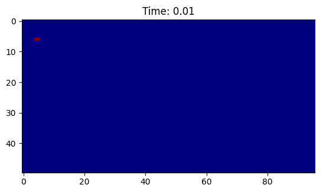

# heateq
Métodos para resolver numéricamente la ecuación de calor en dos dimensiones

| Material                                | Diffusivity (mm²/s) |
|-----------------------------------------|---------------------|
| Pyrolytic graphite (parallel to layers) | 1220                |
| Diamond                                 | 1060 - 1160         |
| Carbon/carbon composite at 25°C         | 216.5               |
| Helium (300 K, 1 atm)                   | 190                 |
| Silver, pure (99.9%)                    | 165.63              |
| Hydrogen (300 K, 1 atm)                 | 160                 |
| Gold                                    | 127                 |
| Copper at 25°C                          | 111                 |
| Aluminium                               | 97                  |
| Silicon                                 | 88                  |
| Al-10Si-Mn-Mg (Silafont 36) at 20°C     | 74.2                |
| Aluminium 6061-T6 Alloy                 | 64                  |
| Molybdenum (99.95%) at 25°C             | 54.3                |
| Al-5Mg-2Si-Mn (Magsimal-59) at 20°C     | 44.0                |
| Tin                                     | 40                  |
| Water vapor (1 atm, 400 K)              | 23.38               |
| Iron                                    | 23                  |
| Argon (300 K, 1 atm)                    | 22                  |
| Nitrogen (300 K, 1 atm)                 | 22                  |
| Air (300 K)                             | 19                  |
| Steel, AISI 1010 (0.1% carbon)          | 18.8                |
| Aluminium oxide (polycrystalline)       | 12.0                |
| Steel, 1% carbon                        | 11.72               |
| Si₃N₄ with CNTs at 26°C                 | 9.142               |
| Si₃N₄ without CNTs at 26°C              | 8.605               |
| Steel, stainless 304A at 27°C           | 4.2                 |
| Pyrolytic graphite (normal to layers)   | 3.6                 |
| Steel, stainless 310 at 25°C            | 3.352               |
| Inconel 600 at 25°C                     | 3.428               |
| Quartz                                  | 1.4                 |
| Sandstone                               | 1.15                |
| Ice at 0°C                              | 1.02                |
| Silicon dioxide (polycrystalline)       | 0.83                |
| Brick, common                           | 0.52                |
| Glass, window                           | 0.34                |
| Brick, adobe                            | 0.27                |
| PC (polycarbonate) at 25°C              | 0.144               |
| Water at 25°C                           | 0.143               |
| PTFE (Polytetrafluoroethylene) at 25°C  | 0.124               |
| PP (polypropylene) at 25°C              | 0.096               |
| Nylon                                   | 0.09                |
| Rubber                                  | 0.089 - 0.13        |
| Wood (yellow pine)                      | 0.082               |
| Paraffin at 25°C                        | 0.081               |
| PVC (polyvinyl chloride)                | 0.08                |
| Oil, engine (saturated liquid, 100°C)   | 0.0738              |
| Alcohol                                 | 0.07                |
